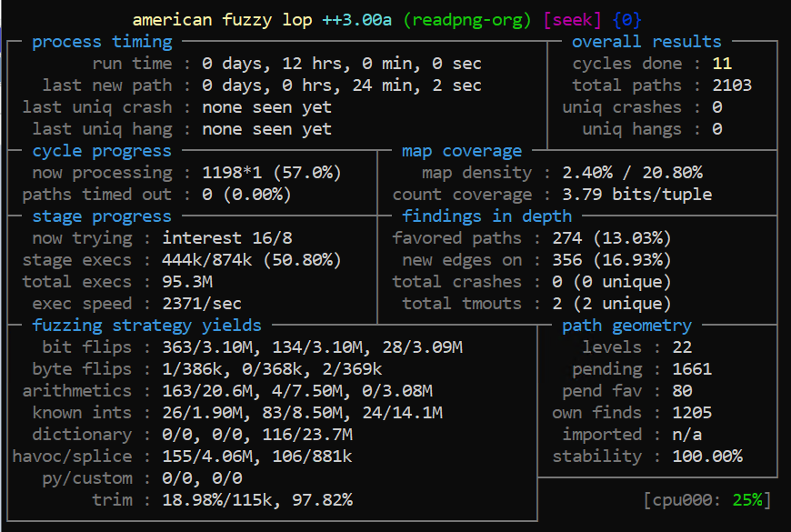
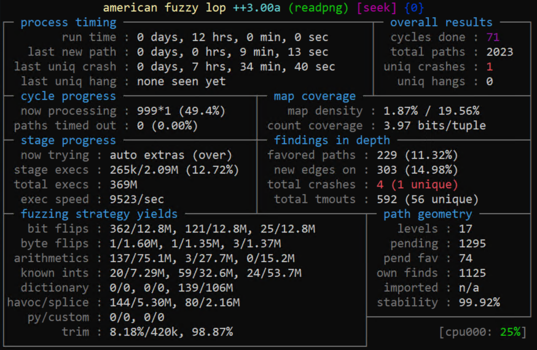
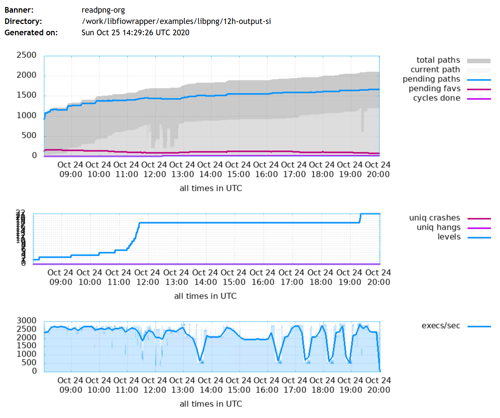

# Performance
## Test Case:
The performance test was build based on the libpng library. The difference between two testing example are only few lines added. There is no change in rest of the code. The original file operation are not changed.

```
/libfiowrapper$ diff ./examples/libpng/readpng-org.c ./examples/libpng/readpng.c
67a68,71
> __AFL_FUZZ_INIT();
> extern void set_memory_size(ssize_t size);
> extern void set_memory_ptr(unsigned char *buffer);
> 
318a323,327
>     // Set the memory pointer
>     set_memory_ptr(__AFL_FUZZ_TESTCASE_BUF);
>     while (__AFL_LOOP(65535)) {
>         // Set the file size.
>         set_memory_size(__AFL_FUZZ_TESTCASE_LEN);
326a336
>     }
```

## Results:

The test was run for 12 hours with AFL++ with the same seed. The result shows that the libfiowrapper is around 4 time faster than normal file fuzzing.

Below image presents the result of the experiment run in 12 hours with default settings and file fuzzing.
|| 
|:--:| 
| *Image 1. Fuzzing with file* |


Below image presents the result of the experiment run in 12 hours with libfiowrapper.
|| 
|:--:| 
| *Image 2. Fuzzing with libfiowrapper* |


|| 
|:--:| 
| *Image 3. Fuzzing with file - stats* |

|| 
|:--:| 
| *Image 4. Fuzzing with libfiowrapper - stats* |


Run on: Linux 4.19.76-linuxkit #1 SMP x86_64
