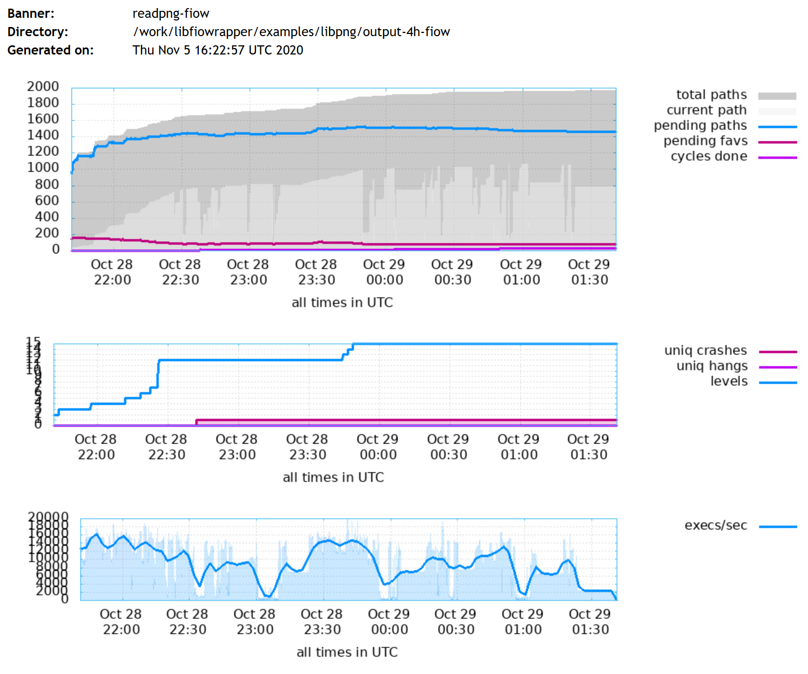
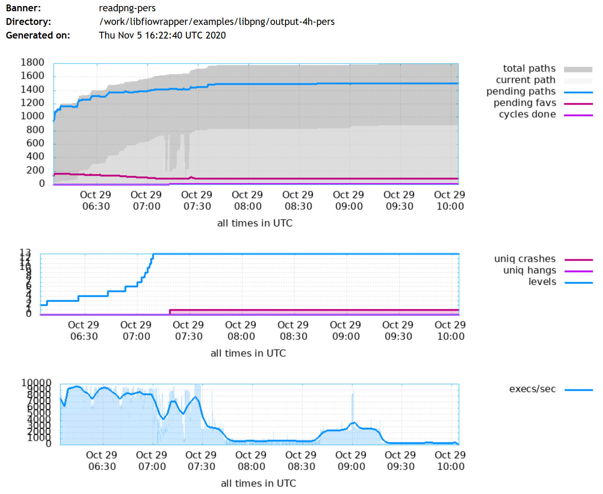

# Performance
The performance test was done on the libpng library with readpng console application. Original source code is available [here](./examples/libpng/readpng.c).

## Setup
For this test, two cases ware prepared. Original file was changed to be fuzzed in the persistent mode and the persistent mode with libfiowrapper. Following diff shows differences between the files. As it can be seen, only few addition lines were added for the libfiowrapper.
```
/research/libfiowrapper/examples/libpng$ diff -u readpng-pers.c readpng-fiow.c
--- readpng-pers.c      2020-11-02 22:58:56.207491235 +0100
+++ readpng-fiow.c      2020-11-02 23:07:21.736258287 +0100
@@ -55,7 +55,7 @@
   /*
    * Modified by: Marek Zmysłowski
    * Copyrights: 2020
-   * This file contains code to be fuzzed in persistent mode.
+   * This file contains code to be fuzzed in persistent mode with libfiowrapper.
    */
 
 #include <stdio.h>
@@ -66,6 +66,10 @@
 #include "png.h"        /* libpng header; includes zlib.h */
 #include "readpng.h"    /* typedefs, common macros, public prototypes */
 
+__AFL_FUZZ_INIT();
+extern void set_memory_size(ssize_t size);
+extern void set_memory_ptr(unsigned char *buffer);
+
 /* future versions of libpng will provide this macro: */
 #ifndef png_jmpbuf
 #  define png_jmpbuf(png_ptr)   ((png_ptr)->jmpbuf)
@@ -317,8 +321,12 @@
     uch red, green, blue;
     int pChannels;
     ulg pRowbytes;
+    // Set the memory pointer
+    set_memory_ptr(__AFL_FUZZ_TESTCASE_BUF);
     while (__AFL_LOOP(65535))
     {
+        // Set the file size.
+        set_memory_size(__AFL_FUZZ_TESTCASE_LEN);
         image_data = NULL;
         infile = fopen(argv[1], "r");
         if (!readpng_init(infile, &w, &h)) {
```
The following commands were used to build the executables:
```
afl-clang-fast readpng-fiow.c -o readpng-fiow ./libpng-code/afl-build/libpng16.a -lz -lm -L../../ -lfiowrapper -I./libpng-code/afl-build -I./libpng-code
```
```
afl-clang-fast readpng-pers.c -o readpng-pers ./libpng-code/afl-build/libpng16.a -lz -lm -I./libpng-code/afl-build -I./libpng-code
```

## Results:
There were 4 tests performed, each took 4 hours with the AFL++. In every case the same seed was used.  The following command was used:
```
afl-fuzz  -i ./input-png/ -o ./output  -s 1234 -V 14400 -p seek -M fiow -m none -- ./readpng-fiow @@

afl-fuzz  -i ./input-png/ -o ./output  -s 1234 -V 14400 -p seek -M pers -m none -- ./readpng-pers @@
```
Here are the results:

|   | Persistent Mode  | libfiowrapper  |
|---|---|---|
| Total execs (Avg) | 76,5M | 140M |
| Total paths | 1860 | 1940 |
| Total crashes | 1 (1 unique) | 1 (1 unique) |


Here are the statistics from the example single run:

|| 
|:--:| 
| *Image 1. Fuzzing with persistent mode + libfiowrapper* |

|| 
|:--:| 
| *Image 2. Fuzzing with persistent mode only - stats* |


The tests were performed inside docker container running Linux 4.19.76-linuxkit #1 SMP x86_64
